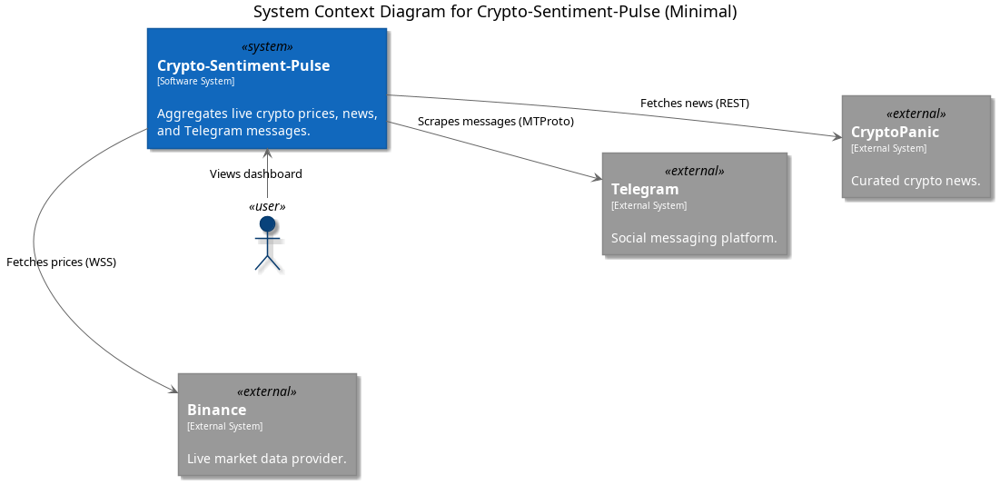
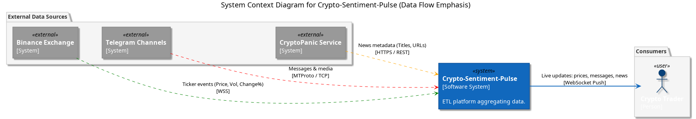
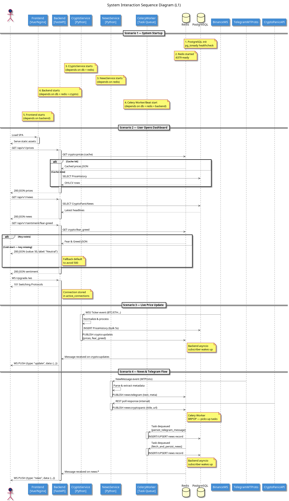

# C4 Level 1: System Level Diagrams

This directory contains the high-level architectural view of **Crypto-Sentiment-Pulse**. It includes two variants of the System Context diagram and a global System Sequence diagram.

---

## 1. System Context: Minimal (v1)
**File:** [L1_system_context_v1.puml](./L1_system_context_v1.puml)

A high-level overview for stakeholders. Focuses on "who uses the system" and "what external systems are involved" without technical complexity.

### Key Aspects:
- Identifies the core **Crypto-Sentiment-Pulse** system.
- Shows users (Crypto Traders) and external data providers (Binance, Telegram, CryptoPanic).
- Simple arrows representing high-level interactions.

*(Placeholder: Export L1_system_context_v1.puml to PNG)*

---

## 2. System Context: Data Flow (v2)
**File:** [L1_system_context_v2.puml](./L1_system_context_v2.puml)

A semi-technical view emphasizing the direction and nature of data streams.

### Key Aspects:
- **Directional Clarity**: Arrows show data moving *from* sources *to* the system, and *from* the system *to* the user.
- **Color-Coded Streams**:
  - Green: Binance Market Data (WSS).
  - Red: Telegram Social Data (MTProto).
  - Orange: CryptoPanic News (REST).
  - Blue: Outbound Live Updates via WebSocket Push.

*(Placeholder: Export L1_system_context_v2.puml to PNG)*

---

## 3. System Sequence: Interaction Flow
**File:** [L1_sequence_system.puml](./L1_sequence_system.puml)

A global sequence diagram showing how the entire system behaves over time across four major scenarios.

### Scenarios Covered:
1. **System Startup**: The initialization order based on container dependencies.
2. **User Dashobard Load**: How the frontend fetches initial data from Redis (cache) or PostgreSQL.
3. **Live Price Update**: The millisecond-level flow from Binance WSS to Browser WebSocket.
4. **News & Telegram Flow**: Asynchronous processing including persistence via Celery workers.

*(Placeholder: Export L1_sequence_system.puml to PNG)*

---

## Exporting Instructions
To generate the images for this document:
1. Open a `.puml` file.
2. Press `Alt + D` (or `Option + D` on Mac) to preview.
3. Right-click in the editor -> **Export Current Diagram**.
4. Save as PNG in this directory with the names specified above.
