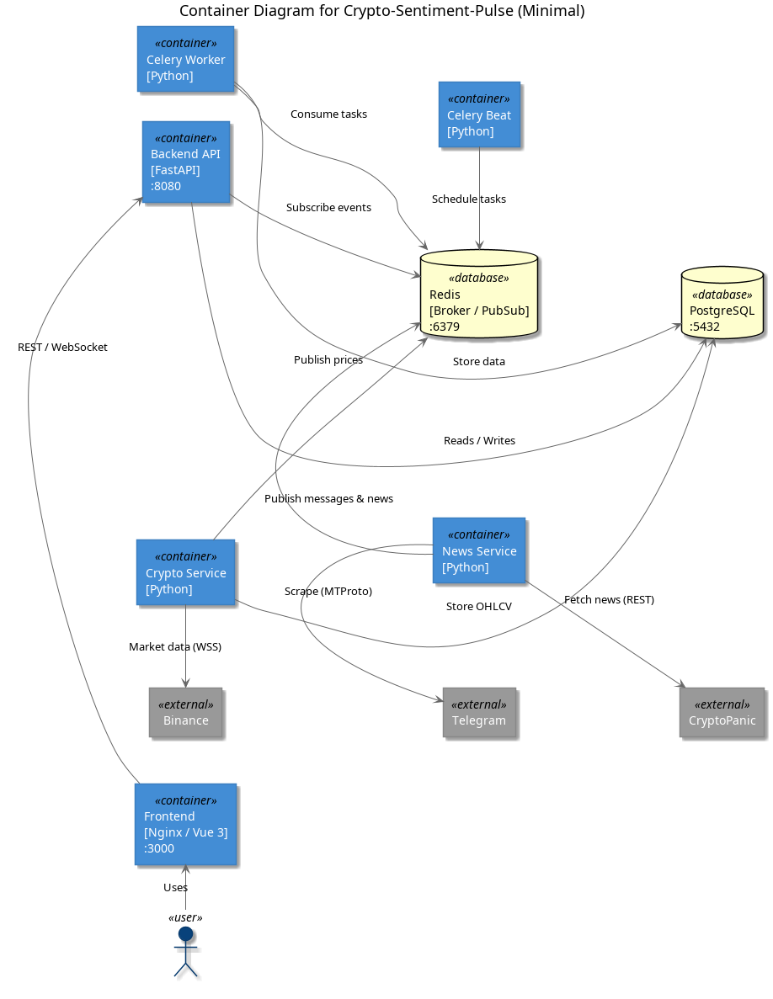
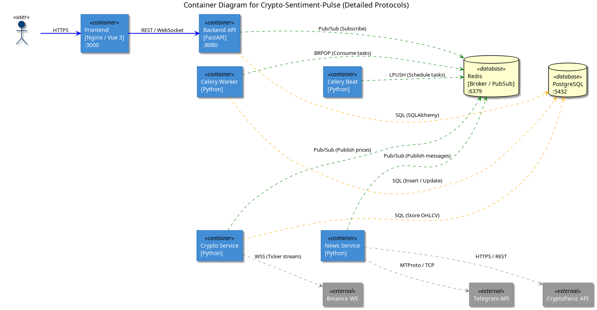
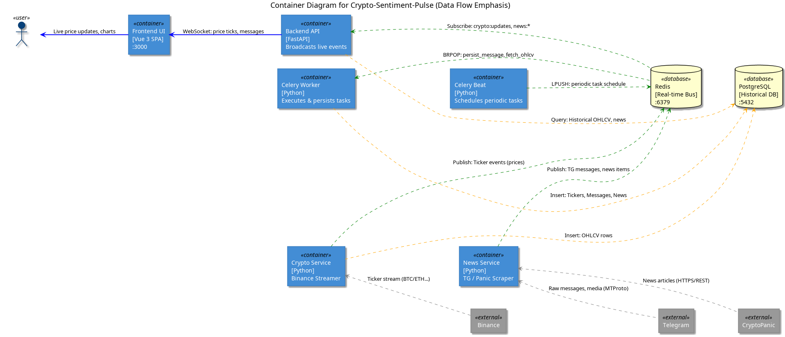
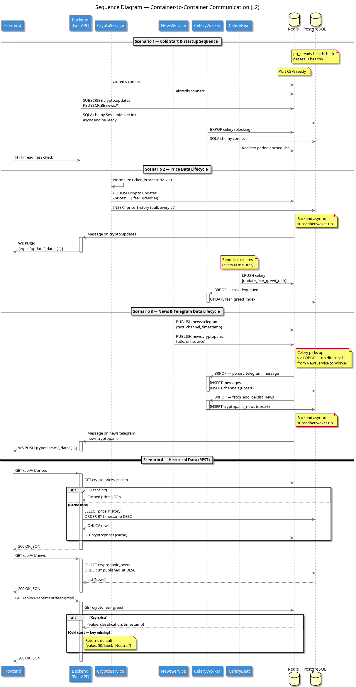

# C4 Level 2: Container Level Diagrams

This level describes the high-level technical architecture of **Crypto-Sentiment-Pulse**, focusing on individual services (containers) and how they communicate internally.

---

## 1. Container Structure: Overview (v1)
**File:** [L2_container_v1.puml](./L2_container_v1.puml)

Provides a clear picture of all microservices, databases, and their general responsibilities.

### Key Aspects:
- Shows **Backend (FastAPI)**, **Frontend (Vue.js)**, **CryptoService**, and **NewsService**.
- Includes the infrastructure layer: **PostgreSQL** and **Redis**.
- Highlights the **Celery Worker/Beat** for background processing.

*(Note: Exported from L2_container_v1.puml)*

---

## 2. Container Structure: Security & Networking (v2)
**File:** [L2_container_v2.puml](./L2_container_v2.puml)

Focuses on the network layout, internal port mapping, and protocol security.

### Key Aspects:
- Explicitly shows **internal port numbers** (8080, 5432, 6379, etc.).
- Defines communication protocols between containers (SQLAlchemy, Redis Pub/Sub, AMQP/Task Queue).
- Visualizes the shared Docker bridge network.

*(Note: Exported from L2_container_v2.puml)*

---

## 3. Container Structure: Real-time Data Flow (v3)
**File:** [L2_container_v3.puml](./L2_container_v3.puml)

The most detailed static view, emphasizing the asynchronous and event-driven nature of the platform.

### Key Aspects:
- **Color Coding**: Separates "Price Flow" from "News Flow".
- **Interaction Detail**: Clearly shows which services *publish* and which *subscribe* to Redis channels.
- **Persistence Path**: Details how News and Telegram data are queued for the Celery Worker to save in the Database.

*(Note: Exported from L2_container_v3.puml)*

---

## 4. Container Sequence: Inter-service Lifecycle
**File:** [L2_sequence_containers.puml](./L2_sequence_containers.puml)

A dynamic diagram showing how containers interact in real-time across four critical scenarios.

### Scenarios Covered:
1. **Scenario 1 — Startup**: Sequence of healthchecks and service stabilization (PostgreSQL -> Redis -> Services).
2. **Scenario 2 — Price Data Lifecycle**: The hop-by-hop journey of a ticker from the CryptoService to the Frontend via Redis and WebSockets.
3. **Scenario 3 — News & Telegram Lifecycle**: How the NewsService uses Celery (LPUSH/BRPOP) to ensure reliable persistence in the database.
4. **Scenario 4 — Cache Strategy**: Shows the "Cache Hit/Miss" logic inside the Backend when a user requests historical data.

*(Note: Exported from L2_sequence_containers.puml)*

---

## Technical Context
- **Orchestration**: Docker Compose
- **Inter-service Auth**: Trusted internal network (no mTLS currently)
- **Shared State**: Redis (Live/Cache), PostgreSQL (History)
- **Asynchrony**: Python `asyncio` + Celery
