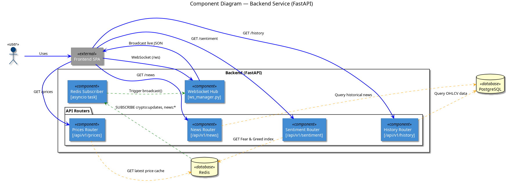
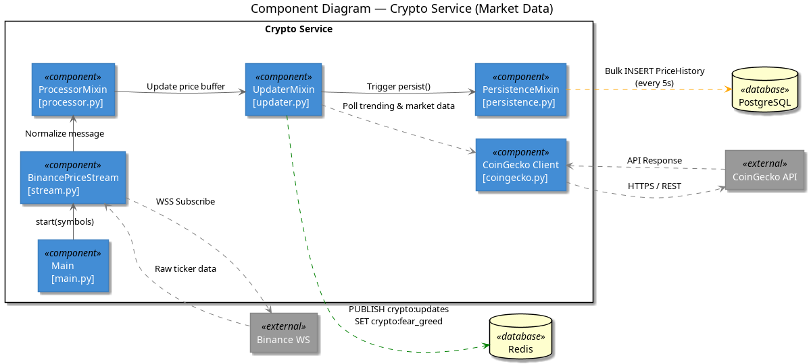
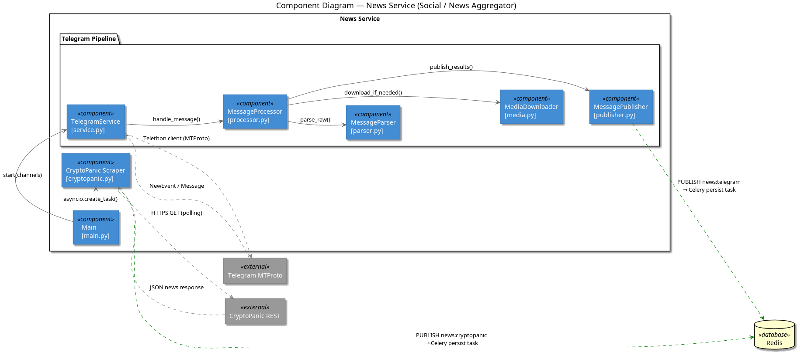
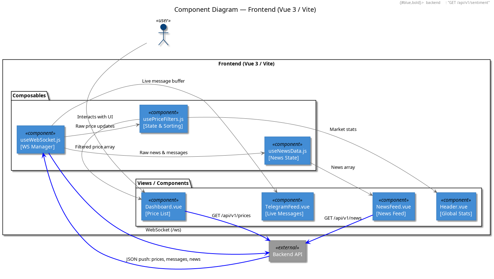

# C4 Level 3: Component Level Diagrams

This level takes a "deep dive" into each service (container), decomposing them into discrete components, classes, and internal logic.

---

## 1. Backend Components
**File:** [backend/L3_component_backend.puml](./backend/L3_component_backend.puml)

Decomposes the FastAPI application into its functional layers.

### Key Components:
- **FastAPI Routers**: Handling HTTP (REST) and WebSockets.
- **WebSocket Hub**: Managing client connections and live broadcasts.
- **Repositories**: Abstracting database access for prices and news.
- **Redis Subscriber**: An `asyncio` task listening for real-time events.

*(Placeholder: Export from [backend/L3_component_backend.puml](./backend/L3_component_backend.puml))*

---

## 2. CryptoService Components
**File:** [crypto_service/L3_component_crypto_service.puml](./crypto_service/L3_component_crypto_service.puml)

Visualizes the streaming and processing engine for market data.

### Key Components:
- **BinancePriceStream**: The orchestrator of life data.
- **Processing Mixins**: Normalized ticker data, updating internal buffers, and handling persistence.
- **FearGreedService**: Integrated module for fetching market sentiment indices.

*(Placeholder: Export from [crypto_service/L3_component_crypto_service.puml](./crypto_service/L3_component_crypto_service.puml))*

---

## 3. NewsService Components
**File:** [news_service/L3_component_news_service.puml](./news_service/L3_component_news_service.puml)

Shows the ingestion pipeline for Telegram messages and CryptoPanic headlines.

### Key Components:
- **Telegram Pipeline**: Service -> Processor -> Parser -> Publisher.
- **MediaDownloader**: Handling binary assets (images) from Telegram.
- **CryptoPanic Poller**: Managing the interval-based REST scraping loop.

*(Placeholder: Export from [news_service/L3_component_news_service.puml](./news_service/L3_component_news_service.puml))*

---

## 4. Frontend Components
**File:** [frontend/L3_component_frontend.puml](./frontend/L3_component_frontend.puml)

Decomposes the Vue 3 application into its reactive parts.

### Key Components:
- **Composables**: `useWebSocket`, `useApp`, and `usePriceFilters` for shared logic.
- **UI Views**: Dashboard and Newsfeed components.
- **API Clients**: Fetching historical data via REST.

*(Placeholder: Export from [frontend/L3_component_frontend.puml](./frontend/L3_component_frontend.puml))*

---

## 5. Internal Logic: Component Sequence
**File:** [L3_sequence_components.puml](./L3_sequence_components.puml)

This is a detailed behavioral diagram showing exact method calls and internal function signatures across four major scenarios.

### Scenarios Covered:
- **Backend**: Path from `Lifespan` startup to `ConnectionManager.broadcast()`.
- **CryptoService**: Call chain from `stream.recv()` through `ProcessorMixin` to `PersistenceMixin`.
- **NewsService (Telegram)**: Message processing through `Parser` and `MediaDownloader` to `Publisher`.
- **NewsService (CryptoPanic)**: The periodic polling loop from `fetch_news()` to Redis publication.

*(Note: Exported from L3_sequence_components.puml)*
