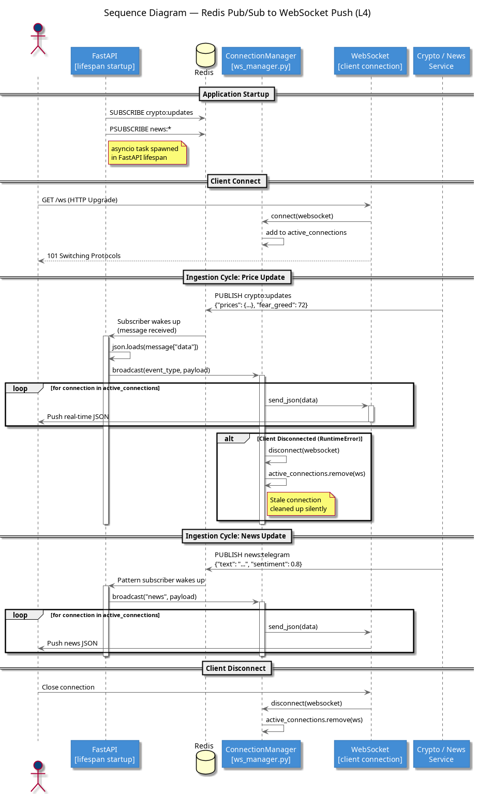
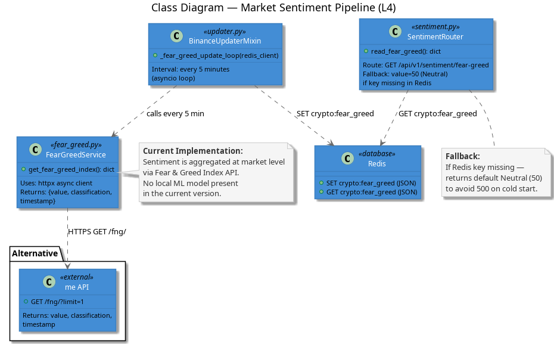

# C4 Level 4: Code Level Diagrams

This is the deepest level of documentation, focusing on individual code-level structures and complex logic flows that are not obvious at higher levels.

---

## 1. Sequence: Redis Pub/Sub to WebSocket Push
**File:** [L4_sequence_redis_websocket.puml](./L4_sequence_redis_websocket.puml)

Traces the millisecond-level path of data from an external publisher to the browser's memory.

### Key Logic:
- **Asyncio Listener**: Shows the background task in FastAPI that waits for Redis events.
- **Broadcast Loop**: Details how the system iterates through active connections.
- **Error Handling**: Visualizes how stale or disconnected clients are silently removed from the list to prevent memory leaks and crashes.
- **Pattern Matching**: Includes logic for pattern-based subscriptions (e.g., `news:*`).

*(Note: Exported from L4_sequence_redis_websocket.puml)*

---

## 2. Class Structure: Market Sentiment Pipeline
**File:** [L4_class_sentiment_pipeline.puml](./L4_class_sentiment_pipeline.puml)

Maps out the classes involved in sourcing and serving market sentiment data (Fear & Greed Index).

### Key Components:
- **FearGreedService**: The abstraction layer over the Alternative.me API.
- **BinanceUpdaterMixin**: The periodic updater that bridges the external API and the local Redis cache.
- **SentimentRouter**: The FastAPI entry point that implements the fallback strategy (Neutral value) for cold starts.
- **Redis Dependency**: Shows the exact keys (`crypto:fear_greed`) and their role as a persistent cache.

*(Note: Exported from L4_class_sentiment_pipeline.puml)*

---

## Technical Maintenance
- **Native PlantUML**: These diagrams use native syntax (no external libraries) to ensure fast rendering and maximum compatibility with local VS Code extensions.
- **Code Traceability**: Class names and function signatures in these diagrams match the Python source code exactly.
